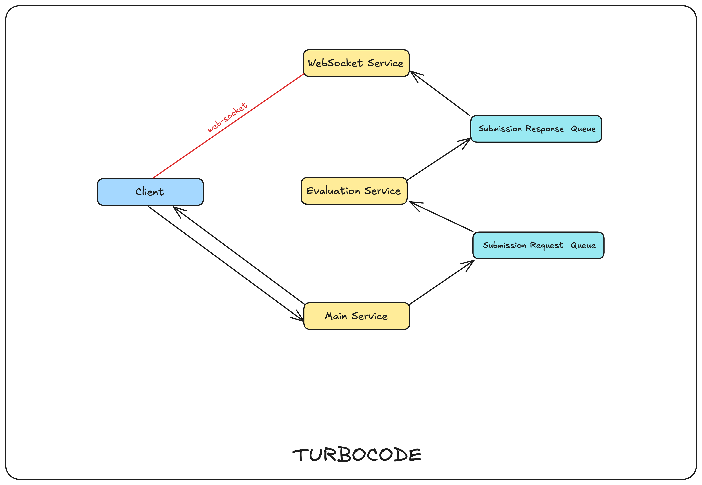

Architecture Diagram for TURBO-CODE-IDE

## TODO List

- List of Files Page in UI and click a value to filter the view.
- Files-related operations in the backend and click a value to filter the view.
- Single File UI and click a value to filter the view.
- Socket.IO Rooms and Notifications.
- Explore Y.js and Y-Monaco for collaborative editing.
- Implement Remote Cursors and Remote Selections in the editor.
